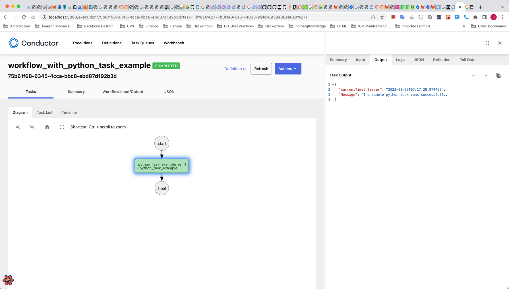
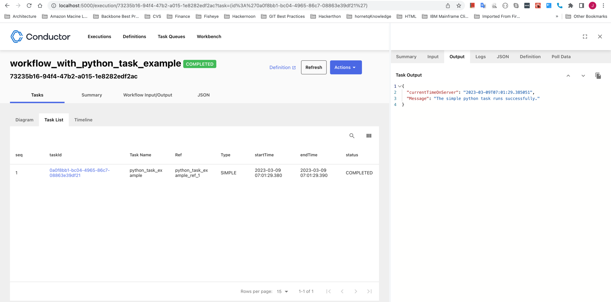

# Running First Worker
In this project, we will explore how you can get your first worker task running.

First clone the project from [here.](https://gitee.unigroupinc.com/learning-and-development/workflow-python) and import to PyCharm.

Worker tasks are implemented by your application(s) and run in a separate environment from Conductor. The worker tasks can be implemented in any language. These tasks talk to the Conductor server via REST/gRPC to poll for tasks and update their status after execution.
In our example, we will be implementing a Python-based worker by leveraging the [Python Client SDK](https://orkes.io/content/docs/how-tos/sdks/conductor-python/main).

Worker tasks are identified by task type SIMPLE in the workflow JSON definition.

## Step 1 - Register the Worker Task
First, let's create a task definition for "python_task_example". Send a POST request to /metadata/taskdefs API endpoint on your conductor server to register these tasks.
```json
[
  {
    "name": "python_task_example",
    "description": "Python task example",
    "retryCount": 3,
    "retryLogic": "FIXED",
    "retryDelaySeconds": 10,
    "timeoutSeconds": 300,
    "timeoutPolicy": "TIME_OUT_WF",
    "responseTimeoutSeconds": 180,
    "ownerEmail": "example@gmail.com"
  }
]
```
we can use the [Swagger API UI](http://localhost:8080/swagger-ui/index.html?configUrl=/api-docs/swagger-config) to make our API calls.
You can also use curl to add a task:
```bash
curl -X 'POST' \
    'https://enterprise-data-dev-conductor-ui.us-e1-cl0.nonprod.unigroup.local/api/metadata/taskdefs' \
    -H 'accept: */*' \
    -H 'Content-Type: application/json' \
    -d '[
    {
      "name": "python_task_example",
      "description": "Python task example",
      "retryCount": 3,
      "retryLogic": "FIXED",
      "retryDelaySeconds": 10,
      "timeoutSeconds": 300,
      "timeoutPolicy": "TIME_OUT_WF",
      "responseTimeoutSeconds": 180,
      "ownerEmail": "example@example.com"
    }
  ]'
```
Here is an overview of the task fields that we just created

1. "name" : A unique name for your task.
2. "retryCount" : Number of retries to attempt when a Task is marked as failure. Defaults to 3 with maximum allowed capped at 10.
3. "retryLogic" : Mechanism for the retries - options are FIXED and EXPONENTIAL_BACKOFF, can be found [here](https://conductor.netflix.com/documentation/configuration/taskdef.html#retry-logic)
4. "retryDelaySeconds" : Time to wait before retrying (Or the time in the exponential back-off calculation).
5. "timeoutSeconds" : Time in seconds, after which the task is marked as TIMED_OUT. (This is optional, and some long running tasks do not need this value.)
6. "timeoutPolicy" : TIME_OUT_WF - Task's timeout policy. Options can be found [here](https://conductor.netflix.com/documentation/configuration/taskdef.html#timeout-policy).
7. "responseTimeoutSeconds" : Must be greater than 0 and less than timeoutSeconds. The task is rescheduled if not updated with a status after this time (heartbeat mechanism). Useful when the worker polls for the task but fails to complete it due to errors/network failure. Defaults to 3600.
8. "ownerEmail" : Mandatory metadata to manage who created or owns this task definition in a shared conductor environment.

More details on the fields used and the remaining fields in the task definition can be found [here](https://conductor.netflix.com/documentation/configuration/taskdef.html).

## Step 2 - Create a Workflow definition
Creating a Workflow definition is similar to creating a task definition. In our workflow, we will use the task we defined earlier. Note that the same Task definitions can be used in multiple workflows, or for multiple times in the same Workflow. Conductor references the task via the taskReferenceName, so each task invocation in the same workflow must have a unique value in this parameter.
```json
{
    "createTime": 1634021619147,
    "updateTime": 1630694890267,
    "name": "workflow_with_python_task_example",
    "description": "Workflow with Python Task example",
    "version": 1,
    "tasks": [
        {
        "name": "python_task_example",
        "taskReferenceName": "python_task_example_ref_1",
        "inputParameters": {},
        "type": "SIMPLE"
        }
    ],
    "inputParameters": [],
    "outputParameters": {
        "workerOutput": "${python_task_example_ref_1.output}"
    },
    "schemaVersion": 2,
    "restartable": true,
    "ownerEmail": "example@example.com",
    "timeoutPolicy": "ALERT_ONLY",
    "timeoutSeconds": 0
}
```
The details on the fields in the workflow definition can be found [here](https://conductor.netflix.com/documentation/configuration/workflowdef/index.html).
Notice that in the workflow definition, we are using a single-worker task created earlier. The task is of type SIMPLE.
We can use [Swagger](http://localhost:8080/swagger-ui/index.html?configUrl=/api-docs/swagger-config#/metadata-resource/create) to add the workflow.

Here is the curl command to add a workflow to a local version of Conductor
```bash
curl -X 'POST' \
    'https://enterprise-data-dev-conductor-ui.us-e1-cl0.nonprod.unigroup.local/api/metadata/workflow' \
    -H 'accept: */*' \
    -H 'Content-Type: application/json' \
    -d '{
    "createTime": 1634021619147,
    "updateTime": 1630694890267,
    "name": "workflow_with_python_task_example",
    "description": "Workflow with Python Task example",
    "version": 1,
    "tasks": [
        {
        "name": "python_task_example",
        "taskReferenceName": "python_task_example_ref_1",
        "inputParameters": {},
        "type": "SIMPLE"
        }
    ],
    "inputParameters": [],
    "outputParameters": {
        "workerOutput": "${python_task_example_ref_1.output}"
    },
    "schemaVersion": 2,
    "restartable": true,
    "ownerEmail": "example@example.com",
    "timeoutPolicy": "ALERT_ONLY",
    "timeoutSeconds": 0
    }'
```
## Step 3 - Starting the Workflow
We've created a task that polls an external workflow and added the task to a workflow. When we run the workflow, Conductor adds a job to the task's queue. Let's do that now:

- In [Swagger](http://localhost:8080/swagger-ui/index.html#/workflow-resource/startWorkflow_1), the endpoint to start a workflow is POST /api/workflow/{workflowName}.
- Using curl to start a workflow:
```bash
curl -X 'POST' \
    'https://enterprise-data-dev-conductor-ui.us-e1-cl0.nonprod.unigroup.local/api/workflow/workflow_with_python_task_example' \
    -H 'accept: text/plain' \
    -H 'Content-Type: application/json' \
    -d '{}'
```
A successful POST request will return a workflow Id, a unique identifier for the invocation of the workflow. Now, we can visualize the execution of the workflow by navigating to http://localhost:5000/execution/<workflowId>.

You should receive a Workflow ID at the Response body 
* Workflow ID example: 8ff0bc06-4413-4c94-b27a-b3210412a914

Now you must be able to see its execution through the UI. 
* Example: http://localhost:5000/execution/8ff0bc06-4413-4c94-b27a-b3210412a914 or https://enterprise-data-dev-conductor-ui.us-e1-cl0.nonprod.unigroup.local/execution/17869a0d-39a2-4436-9403-9fc1746a2ce8

The API path contains the workflow name workflow_with_python_task_example and our workflow doesn't need any inputs, so the body of the call is an empty JSON string: {}.

## Step 4 - Poll for Worker Task
Notice that the workflow is running. If you click on python_task_example_ref_1 in the diagram, you can see that the task is marked as SCHEDULED. Conductor is ready to send this task off for processing, but we have not yet connected our worker to Conductor to do that work.

In the next step, we will create the worker that is used to complete our Conductor task. We'll also connect it to our Conductor instance so that the python_task_example tasks can be completed and allow our workflows to be complete.

## Step 5 Building the worker
The SimplePythonWorker worker in a [SimplePythonWorker](src/task/example/SimplePythonWorker.py).

The worker will poll the conductor server every two second to see if there is a task in its queue. For that to happen, we need to tell the worker where our Conductor server is. To do this, we must modify the file [.env](./.env).

- For a local Conductor installation, change CONDUCTOR_URL_BASE to http://localhost:8080/api.
- For DEV, change CONDUCTOR_URL_BASE to https://enterprise-data-dev-conductor-ui.us-e1-cl0.nonprod.unigroup.local/api

## Step 6: Running your worker
Run your Python file with the main method to start running your worker.
```bash
brew install make
python3 -m venv env
source env/bin/activate
make install
make dev
```
Download and install ssl certificate to VM to avoid SSLCertVerificationError
```bash
openssl s_client -showcerts -connect enterprise-data-dev-conductor-ui.us-e1-cl0.nonprod.unigroup.local:443 </dev/null 2>/dev/null | sed -n -e '/-BEGIN CERTIFICATE-/,/-END CERTIFICATE-/p' > unigroup-com.pem
```
```bash
 cat unigroup-com.pem | tee -a ~/Documents/workspace-sts-3.1.0.RELEASE/workflow-python/env/lib/python3.10/site-packages/certifi/cacert.pem
```




